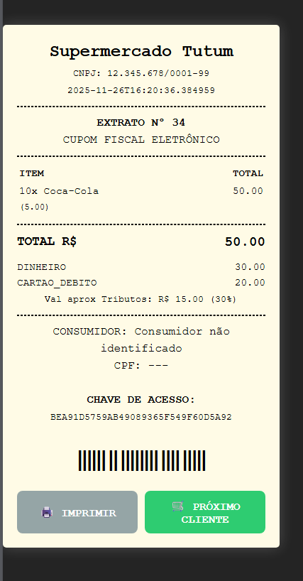

# PDV Frontend (React)

Interface de Ponto de Venda moderna desenvolvida com **React + Vite**. Este projeto consome a API RESTful (`pdv-api`) para realizar vendas, gerenciar caixa e emitir cupons fiscais.

## Funcionalidades

* **Operação via Teclado:** Comandos rápidos (`F1` focar, `*` multiplicar, `-` remover).
* **Pagamento Misto:** Suporte a múltiplas formas de pagamento na mesma venda (Dinheiro + Cartão).
* **Nota Fiscal:** Geração automática de cupom fiscal térmico na tela.
* **Segurança:** Autenticação via Basic Auth integrada ao Spring Security.

## Tecnologias

* React.js
* Axios (Conexão HTTP)
* CSS Modules (Estilização Customizada)
* Vite (Build Tool)

## Screenshots & Vídeo Introdutório
Abaixo, você conseguirá ver o vídeo e o Cupom Fiscal:

https://github.com/user-attachments/assets/677dcae8-39e7-4cf3-9f1a-747549566be0



## Como Rodar

1.  Certifique-se que o Backend Java está rodando na porta 8080.
2.  Instale as dependências:
```
npm install
```
3.  Rode o projeto:
```
npm run dev
```
